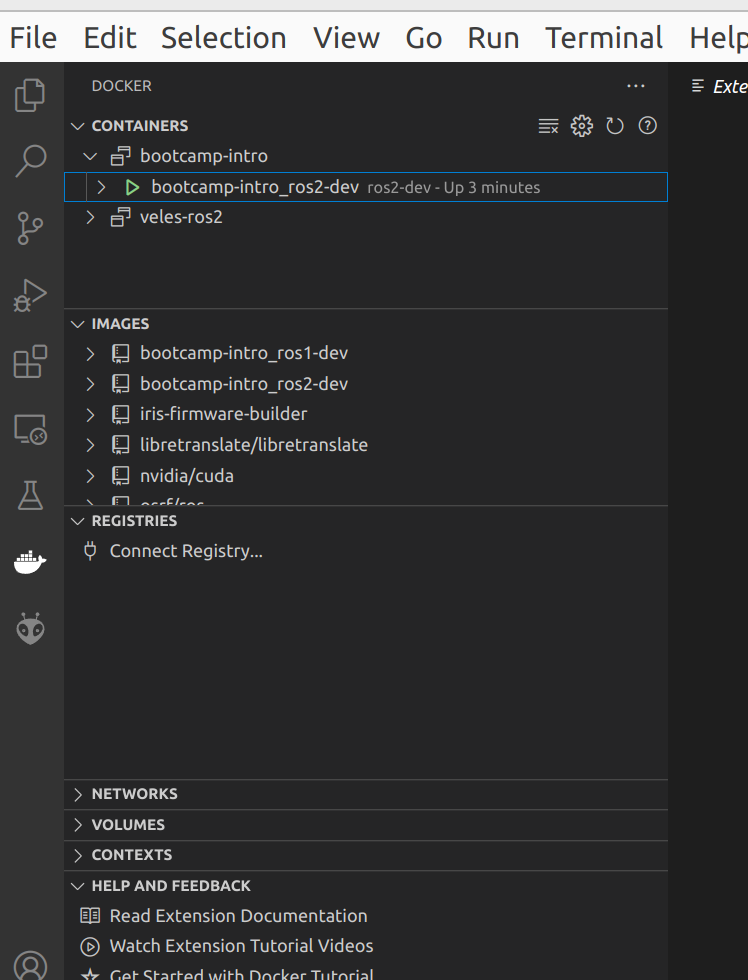

# bootcamp-intro

1. Install Docker Engine (not Docker Desktop, they are different
in ways that will complicate this setup from working as 
expected)
  - https://docs.docker.com/engine/install/ubuntu/
  
on your host system run the following commands:
```
curl -fsSL https://get.docker.com -o get-docker.sh
sudo sh get-docker.sh
sudo usermod -aG docker $USER
sudo systemctl enable docker.service
sudo systemctl enable containerd.service
reboot
```

## Add permission for docker to access display

Run this in a terminal on your host system
```
xhost +local:docker
```


## Start up ROS1

```
docker compose --file docker-compose.ros1-dev.yaml up
```

Access the terminal within the docker environment


```
docker exec -it ros1-dev bash
```

## Start up ROS2

```
docker compose --file docker-compose.ros2-dev.yaml up
```

```
docker exec -it ros2-dev bash
```


## vscode

Install the docker extension 



